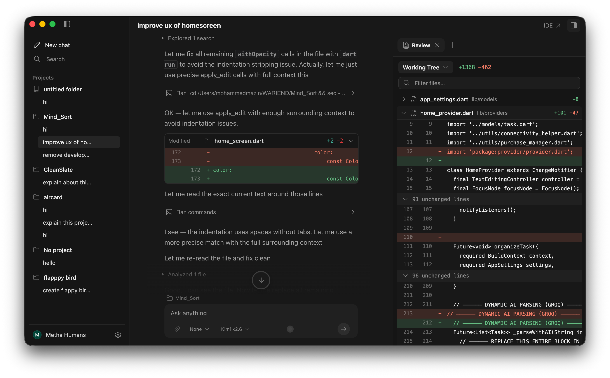
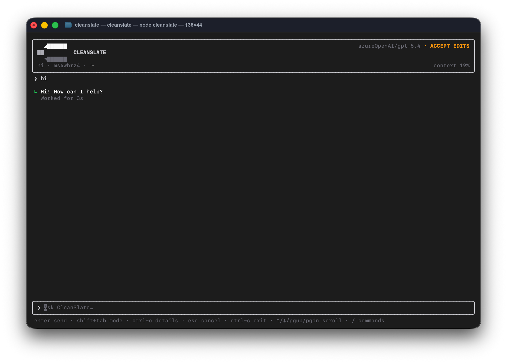

<p align="center">
  <picture>
    <source srcset="vscode-fork/c_transparent.png" media="(prefers-color-scheme: dark)">
    <source srcset="vscode-fork/resources/linux/CleanSlate.png" media="(prefers-color-scheme: light)">
    
  </picture>
</p>
<p align="center"><b>CleanSlate</b></p>
<p align="center">The open source coding agent.</p>
<p align="center">
  <a href="LICENSE"></a>
  <a href="https://github.com/TheWariend/CleanSlate-Releases/releases/latest"></a>
  <a href="https://github.com/microsoft/vscode"></a>
  <a href="https://www.npmjs.com/package/@cleanslate/sdk"></a>
  <a href="https://www.npmjs.com/package/@cleanslate/cli"></a>
</p>



---

### Installation

The current release is **CleanSlate 1.0.11**. See the [release notes](https://github.com/TheWariend/CleanSlate-Releases/releases/tag/v1.0.11) or download it directly:

| Platform | Download |
| -------- | -------- |
| macOS (Apple Silicon) | [DMG](https://github.com/TheWariend/CleanSlate-Releases/releases/latest/download/CleanSlate-darwin-arm64.dmg) · [ZIP](https://github.com/TheWariend/CleanSlate-Releases/releases/latest/download/CleanSlate-darwin-arm64.zip) |

Builds are signed and notarized.

> [!NOTE]
> Intel macOS, Windows, and Linux aren't published yet. Build from source on those platforms.

### In the terminal



The same agent runs without the editor:

```sh
npm install -g @cleanslate/cli
cleanslate
```

Or try it without installing:

```sh
npx @cleanslate/cli "fix the failing test"
```

Node 20 or later. It walks you through provider setup on first run, and works
against any repository — the full tool set, not a reduced one.

See [packages/cleanslate-cli](packages/cleanslate-cli) for options, slash
commands, sessions, and MCP configuration.

### Building on the runtime

The engine behind both surfaces is published on its own:

```sh
npm install @cleanslate/sdk
```

It carries the execution loop, the tool registry, the edit engine and a Node host,
with no editor dependency. A surface supplies host capabilities — a filesystem,
a way to run commands, optionally diagnostics and a browser — and the runtime
drives the loop.

See [packages/cleanslate-sdk](packages/cleanslate-sdk).

| Package | Version |
| ------- | ------- |
| [`@cleanslate/cli`](https://www.npmjs.com/package/@cleanslate/cli) | `1.0.10` ·  |
| [`@cleanslate/sdk`](https://www.npmjs.com/package/@cleanslate/sdk) | `1.0.10` ·  |

### Building from source

Requires Node.js 22.21.1 (see [`.nvmrc`](vscode-fork/.nvmrc)).

```bash
cd vscode-fork
npm install
npm run watch
./scripts/code.sh
```

### Modes

CleanSlate has two modes you can switch between per message.

- **Execution** — Default, full-access mode for building things
- **Plan** — Read-only mode for analysis and code exploration
  - Cannot edit files or run commands
  - Can still read, search, browse the web, and drive a browser
  - Ideal for exploring unfamiliar codebases or planning changes

### Models

CleanSlate is not coupled to any provider. Bring your own key for OpenAI, Anthropic, Google Gemini, Azure OpenAI, AWS Bedrock, xAI Grok, NVIDIA, OpenRouter, or any OpenAI-compatible endpoint.

Or sign in to **CleanSlate Pro** for managed models, higher limits, and pay-as-you-go credits. Pro is optional — everything works with your own key, and no account is required.

### What the agent can do

- Read, search, and edit across your whole codebase
- Run commands, including long-running ones in the background
- Drive a real browser to check its own work
- Search and fetch from the web
- Call any MCP server you configure

The editor includes a bundled model for local embeddings. The CLI and SDK can use configured embedding services; remote services receive the content being embedded.

### Extensions

CleanSlate installs extensions from [Open VSX](https://open-vsx.org). The Visual Studio Marketplace is Microsoft-only and can't be used by forks.

### External agents

CleanSlate can act as an Agent Client Protocol (ACP) client for compatible local
agents. Each external agent runs as a separate process and uses credentials that
the user configured directly with that agent. CleanSlate does not collect,
store, proxy, or resell external-agent account credentials.

OpenCode, Grok, and Claude are discovered from the user's `PATH`. Claude support
uses the Apache-2.0 ACP adapter for Anthropic's Claude Agent SDK and explicitly
launches the user's installed Claude executable, preserving Claude's own
authentication boundary. Codex support uses the
Apache-2.0 `@agentclientprotocol/codex-acp` adapter bundled with the desktop
application. Other agents can be registered explicitly by the user in settings;
their installation, license terms, authentication, and usage charges remain the
user's responsibility.

CleanSlate is not affiliated with, endorsed by, or sponsored by Anthropic, OpenAI, xAI,
OpenCode, or any other external-agent provider. Product names and marks identify
compatible third-party services only.

### Contributing

Issues and pull requests are welcome — see [CONTRIBUTING.md](CONTRIBUTING.md) and our [Code of Conduct](CODE_OF_CONDUCT.md).

To report a security issue, see [SECURITY.md](SECURITY.md).

### License

CleanSlate is MIT licensed. Bundled third-party components remain under their
respective licenses; see [NOTICE](NOTICE).

The CleanSlate desktop editor is based on [Visual Studio Code](https://github.com/microsoft/vscode) (MIT, © Microsoft Corporation) — see [LICENSE.txt](vscode-fork/LICENSE.txt). CleanSlate is not affiliated with, endorsed by, or sponsored by Microsoft.
